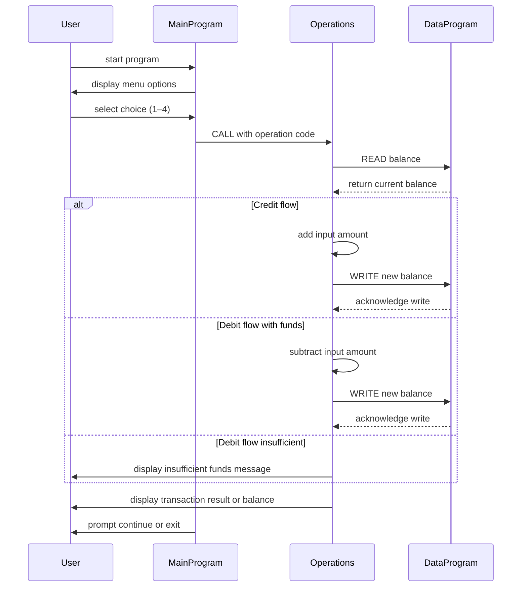

# COBOL Account Management System Documentation

This repository contains a small COBOL-based account management system designed as a teaching aid. The code is organized into three primary programs, each responsible for a different aspect of the system. The focus is on basic operations related to a student account with a simple balance stored in memory.

## 📁 Source Files Overview

### `main.cob`
- **Purpose:** Acts as the user-facing entry point. It presents a menu, accepts input, and delegates tasks to the `Operations` program.
- **Key Features:**
  - Loop until the user chooses to exit
  - Menu options: View balance, credit account, debit account, exit
  - Input validation for choices outside 1–4
  - Calls the `Operations` program with an operation code

### `operations.cob`
- **Purpose:** Contains logic for interpreting the requested operation and performing calculations.
- **Key Features:**
  - Reads the requested operation via the linkage section
  - Handles three operations:
    - **TOTAL:** Reads and displays the current balance
    - **CREDIT:** Prompts for an amount, reads current balance, adds amount, writes back, and reports new balance
    - **DEBIT:** Prompts for an amount, reads current balance, checks sufficient funds, subtracts if possible, writes back, otherwise displays an error
  - Delegates read/write actions to `DataProgram`

### `data.cob`
- **Purpose:** Simulates persistent storage of the student account's balance. It is essentially an in-memory data handler used by the other programs.
- **Key Features:**
  - Maintains `STORAGE-BALANCE` as the single source of truth
  - Supports two operations via linkage:
    - **READ:** Copy `STORAGE-BALANCE` to the passed `BALANCE` variable
    - **WRITE:** Update `STORAGE-BALANCE` with the passed `BALANCE` value

## 🎓 Business Rules for Student Accounts

- Each student has a single account represented by a numeric balance (`PIC 9(6)V99`).
- The initial balance is set to `1000.00`.
- **Viewing balance** does not alter stored data.
- **Credits** increase the balance by the entered amount.
- **Debits** decrease the balance only if sufficient funds exist; otherwise, the transaction is rejected and the balance remains unchanged.
- No negative balances are allowed; the system enforces non‑negative balances through conditional checks before debits.
- The design assumes a single account accessible in memory; no multi-user or persistence beyond runtime is implemented.

---

This documentation should assist students and maintainers in understanding file responsibilities, flow of control, and the simple business logic embedded in this legacy COBOL example.

## 📊 Application Sequence Diagram

Below is a Mermaid sequence diagram illustrating the data flow between the user interface and the COBOL programs:

